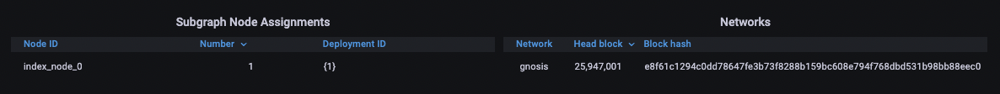

## Открытие графаны
Перейдите по адресу `https://graph-dashboard-mainnet.{{domain}}` *заменив {{domain}} на ваш домен*

Должна открыться графана


Если графана не открылась, попробуйте выполнить следующую комманду, немного подождать и обновить:
```bash
bash start --force-recreate nginx-ssl
```

## Логин
Для логина в графану используйте 
логин `admin`
пароль: который вы вписывали в `admin_password`. 

## Проверка работоспособности
Откройте `https://graph-dashboard-mainnet.{{domain}}/d/indexing-status-overview/indexing-status-overview?orgId=1`

У вас должен быть сабграф `QmXWbpH76U6TM4teRNMZzog2ismx577CkH7dzn1Nw69FcV` с небольшим значением Blocks behind

Отскрольте страницу в самый низ. Там должен быть gnosis


После этого откройте страницу `https://graph-dashboard-mainnet.{{domain}}/d/query-performance-metrics/query-performance-metrics?orgId=1`. Через некоторое время там должны пойти запросы